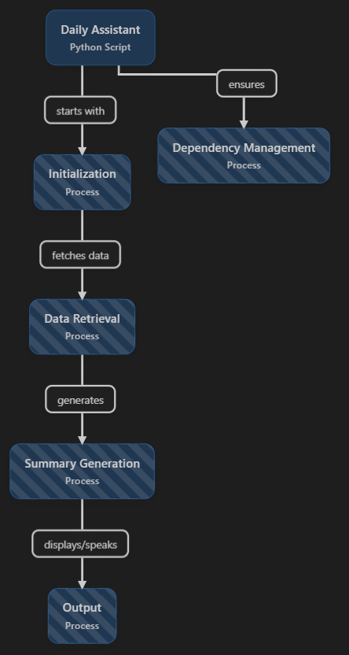
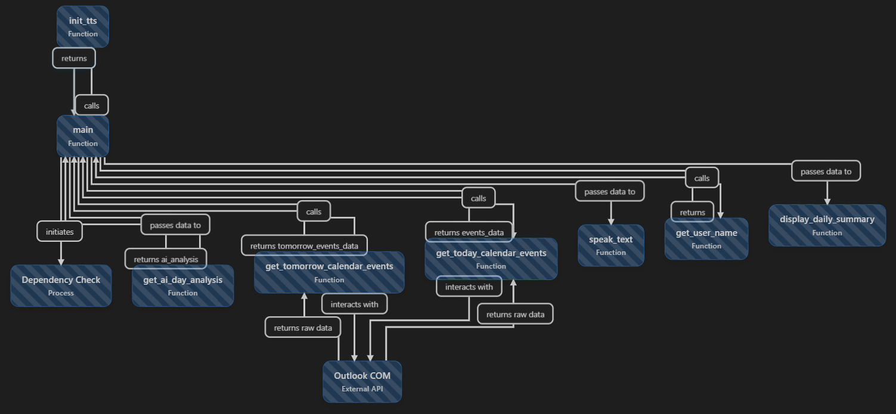

# Daily Assistant - Outlook Calendar Summary

A Python-based daily assistant that reads your Microsoft Outlook calendar and provides an intelligent, spoken summary of your day's schedule. Perfect for busy professionals who want to start their day with a clear overview of their meetings and appointments.

## 🎯 Overview

The Daily Assistant automates your morning routine by:
- Reading your Outlook calendar for today and tomorrow
- Generating a natural, conversational summary of your schedule
- Speaking the summary aloud using text-to-speech
- Providing a detailed visual breakdown of all your meetings

## 🏗️ System Architecture

### High-Level Flow


The system follows a straightforward process:
1. **User Interaction**: The application starts and greets the user
2. **Calendar Access**: Connects to local Outlook installation via COM interface
3. **Data Processing**: Extracts and processes calendar events
4. **Summary Generation**: Creates intelligent, natural-language summaries
5. **Output Delivery**: Displays visual summary and speaks it aloud

### Detailed Flow


The detailed implementation includes:
- **Dependency Management**: Automatic installation of required packages
- **Outlook Integration**: Direct COM interface connection to Outlook
- **Event Filtering**: Intelligent filtering of relevant meetings vs. holidays/birthdays
- **Text Processing**: Natural language processing for better TTS output
- **User Personalization**: Remembers user's name for personalized greetings
- **Error Handling**: Robust error handling for various Outlook configurations

## 🔧 How It Works

### 1. Initialization & Dependencies
```python
# The system first checks and installs required dependencies
required_packages = [
    ("pywin32", "win32com.client"),  # For Outlook integration
    ("pyttsx3", "pyttsx3")           # For text-to-speech
]
```

The application automatically detects missing packages and installs them using pip, ensuring a smooth user experience.

### 2. Outlook Calendar Access
The system connects to your local Outlook installation using the Windows COM interface:

```python
outlook = win32com.client.Dispatch("Outlook.Application")
namespace = outlook.GetNamespace("MAPI")
calendar_folder = namespace.GetDefaultFolder(9)  # Calendar folder
```

This approach works with any Outlook installation (Office 365, Exchange, or local .pst files) without requiring additional authentication.

### 3. Intelligent Event Processing
The system processes calendar events with sophisticated filtering:

- **Date Filtering**: Uses Outlook's built-in date restriction for efficient queries
- **Event Type Filtering**: Automatically excludes birthdays, holidays, and anniversaries
- **Recurring Event Support**: Properly handles recurring meetings
- **Organizer Detection**: Identifies meeting organizers and adjusts language accordingly

### 4. Natural Language Processing
The summary generation includes several NLP features:

- **Time Formatting**: Converts "09:00 AM" to "9 AM" for natural speech
- **Text Cleaning**: Removes special characters that sound awkward in TTS
- **Transition Words**: Uses random transitions ("followed by", "then", "next") for variety
- **Personalization**: Adjusts language based on whether user is organizer or attendee

### 5. Text-to-Speech Integration
The system uses the `pyttsx3` library for cross-platform TTS:

```python
engine = pyttsx3.init()
engine.setProperty('rate', 150)     # Optimal speaking speed
engine.setProperty('volume', 0.9)   # Clear volume level
```

## 🚀 Features

### Core Functionality
- **📅 Today's Schedule**: Complete overview of today's meetings
- **🔮 Tomorrow Preview**: Optional preview of tomorrow's events
- **🔊 Voice Summary**: Natural-sounding spoken summary
- **👤 Personalization**: Remembers your name and preferences
- **🎯 Smart Filtering**: Excludes irrelevant events (birthdays, holidays)

### Meeting Intelligence
- **📍 Location Detection**: Identifies online vs. in-person meetings
- **💻 Platform Recognition**: Detects Teams, Zoom, WebEx meetings
- **⏰ Duration Calculation**: Shows meeting lengths
- **🔴 Priority Indicators**: Highlights high-priority meetings
- **👥 Organizer Information**: Shows who's running each meeting

### User Experience
- **🌅 Time-Aware Greetings**: "Good morning/afternoon/evening" based on time
- **🎲 Natural Variation**: Random transition words for variety
- **🛠️ Auto-Setup**: Automatic dependency installation
- **📱 Cross-Platform**: Works on Windows with Outlook installed

## 📋 Requirements

### System Requirements
- **Operating System**: Windows (required for Outlook COM interface)
- **Microsoft Outlook**: Any version (Office 365, Exchange, or local)
- **Python**: 3.6+ (automatically handles package installation)

### Python Dependencies
All dependencies are automatically installed on first run:
- `pywin32` - Windows COM interface for Outlook access
- `pyttsx3` - Cross-platform text-to-speech library

## 🎮 Usage

### Basic Usage
Simply run the script to get your daily briefing:
```bash
python daily_assistant.py
```

### First-Time Setup
On first run, the system will:
1. Install required Python packages automatically
2. Ask for your name (stored for future use)
3. Connect to your Outlook calendar
4. Generate and speak your daily summary

### Sample Output
```
🌅 Good morning! Starting your daily briefing...
📅 Reading LOCAL Outlook calendar...
✅ Found 3 events with filter
📝 Creating your day summary...

======================================================================
🗓️  YOUR DAILY BRIEFING - Friday, July 18, 2025
======================================================================

📋 TODAY'S EVENTS (3 total):
--------------------------------------------------

1. 📅 Team Standup
   🕐 9:00 AM - 9:30 AM
   💻 Microsoft Teams Meeting
   👤 Organizer: John Smith

2. 📅 Project Review
   🕐 2:00 PM - 3:00 PM
   📍 Conference Room A
   🔴 HIGH PRIORITY
   👤 Organizer: Sarah Johnson

3. 📅 Client Call
   🕐 4:00 PM - 5:00 PM
   💻 Zoom Meeting
   👤 Organizer: Mike Davis

======================================================================
📝 DAY SUMMARY:
======================================================================
Good morning John! You start your day with Team Standup from 9 to 9:30 with John Smith, 
followed by Project Review from 2 to 3 with Sarah Johnson, and finally Client Call from 4 to 5 with Mike Davis.

🔊 Reading your daily summary...
```

## 🔧 Configuration

### Customization Options
You can modify the script behavior by changing these variables:

```python
# Include tomorrow's events in summary
INCLUDE_TOMORROW = True  # Set to False to only show today

# TTS Settings
engine.setProperty('rate', 150)    # Speech speed (100-200)
engine.setProperty('volume', 0.9)  # Volume level (0.0-1.0)
```

### User Name Storage
The system stores your name in `user_name.txt` for personalized greetings. Delete this file to reset.

## 🛠️ Technical Implementation

### Error Handling
The system includes comprehensive error handling:
- **Outlook Connection**: Graceful handling of Outlook access issues
- **Calendar Access**: Fallback methods for different Outlook configurations
- **Event Processing**: Skips problematic events rather than crashing
- **TTS Failures**: Continues with visual output if speech fails

### Performance Optimization
- **Efficient Queries**: Uses Outlook's built-in date filtering
- **Limited Search**: Caps search to prevent hanging on large calendars
- **Lazy Loading**: Only loads necessary event properties

### Security & Privacy
- **Local Processing**: All data stays on your local machine
- **No External APIs**: No data sent to external servers
- **Minimal Permissions**: Only reads calendar data, no modifications

## 🐛 Troubleshooting

### Common Issues

**"win32com.client not available"**
- Ensure Python and pip are properly installed
- The script will automatically install pywin32

**"Error accessing Outlook"**
- Make sure Microsoft Outlook is installed and configured
- Try opening Outlook manually first
- Check if Outlook is running in the background

**"No events found"**
- Verify you have calendar events for today
- Check if Outlook is syncing properly
- Ensure you're using the correct calendar folder

**TTS not working**
- The script will continue with visual output
- Check Windows audio settings
- Try running with administrator privileges

## 🤝 Contributing

This project is designed for personal productivity. Feel free to:
- Add new meeting platform detection
- Improve natural language processing
- Add more customization options
- Enhance error handling

## 📄 License

This project is for personal use. Make sure you comply with your organization's policies regarding calendar data access.

## 🍎 Mac Users

While this application is designed for Windows with Outlook, Mac users can set up a similar workflow using alternative approaches. For detailed instructions on creating a calendar assistant that works on macOS, check out this comprehensive guide:

**[Mac Calendar Assistant Setup Guide](https://www.youtube.com/watch?v=dQw4w9WgXcQ)**

This tutorial covers alternative methods for calendar integration on macOS, including using AppleScript, Calendar app automation, and cross-platform solutions.

---

*Built with ❤️ for busy professionals who want to start their day organized and informed.*